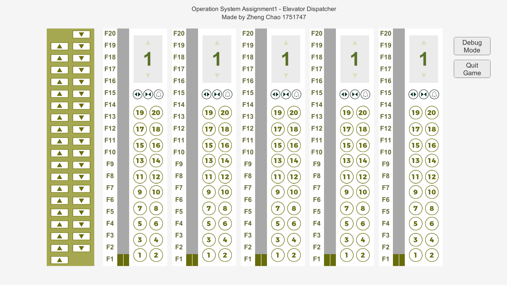
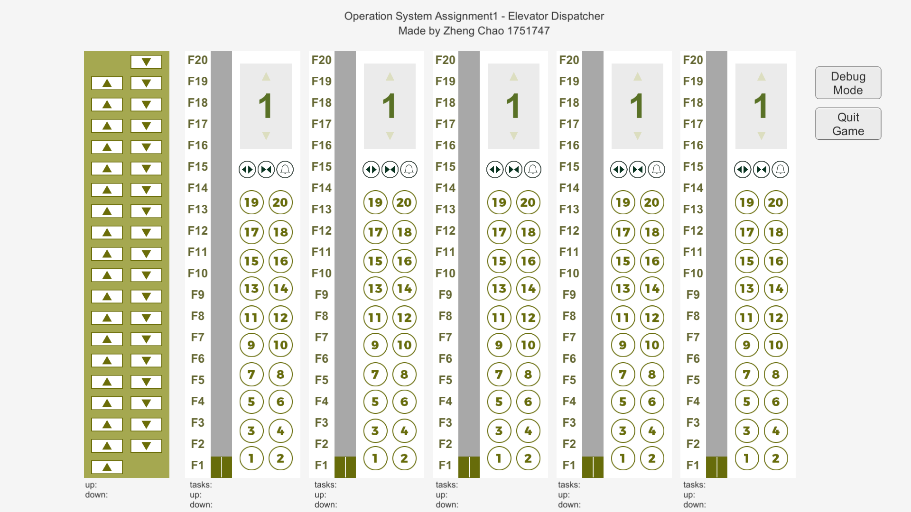
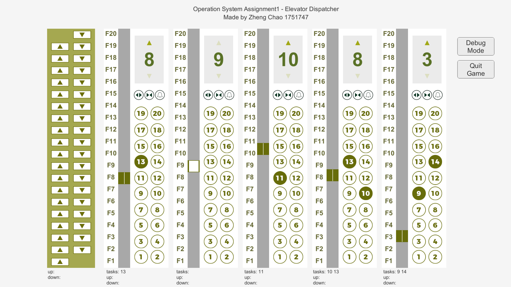
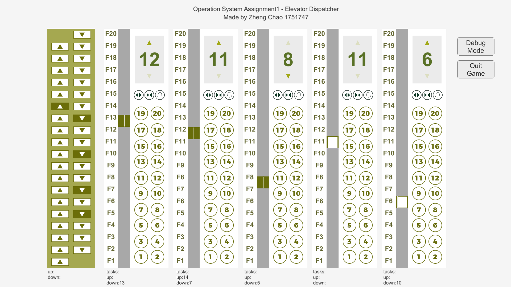
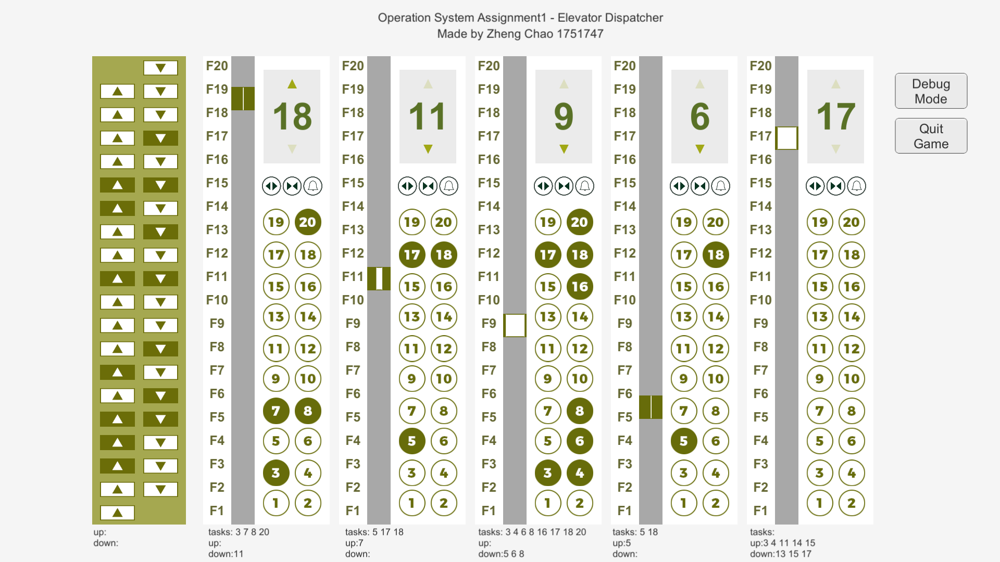

# 电梯调度系统说明文档
**Operation System Assignment1**

**郑超 1751747**
## 一、项目分析
### 项目背景
某一层楼20层，有五部互联的电梯，基于线程思想，编写一个电梯调度程序。
### 项目目的
- 学习调度算法
- 通过实现电梯调度，体会操作系统调度过程
- 学习特定环境下多线程方法
### 项目需求
- **电梯内部功能键与状态显示**：
  - 数字键、关门键、开门键、上行键、下行键、报警键、当前电梯的楼层数、上升及下降状态等。
- **电梯外部功能键与状态显示**：
  - 上行键、下行键、当前电梯状态的数码显示器。
- **其它**： 
  - 五部电梯外部按钮互联结。（即：当一个电梯按钮按下去时，其他电梯的相应按钮也就同时点亮。）
  - 所有电梯初始状态都在第一层。
  - 每个电梯如果在它的上层或者下层没有相应请求情况下，在原地保持不动。
## 二、开发工具
- **开发环境**：Windows
- **开发工具**：Unity3D
- **开发语言**：C#
## 三、设计思路
### 电梯运行
- **电梯有三个状态**：静止、上行和下行。
  - 若电梯任务列表为空，电梯处于静止状态。
  - 若电梯任务列表不为空，电梯运行遵循以下规则：
    - 加入的第一个任务决定电梯初运行状态。
    - 电梯具有“惯性”，若原本处于上行状态，就会一直保持上行状态，直到再无比当前楼层更高的任务。
### 电梯任务
- **电梯任务分为外部和内部任务**
  - 外部任务来自外部的上下按钮，由总控制器计算分配给某个电梯。
  - 内部任务来自电梯内部的楼层按钮，直接加入电梯任务的列表。
- **总控制器的分配原则**
  - 任务优先分配给运行状态的电梯，其次才是等待状态的电梯。
  - 任务分配给运行状态电梯时，限制任务的楼层数应该处于运行状态电梯当前执行方向的可能停靠楼层中。
  - 若找不到符合要求的电梯，则将任务挂起，放在总控制器的待分配任务列表中。
## 四、实现
### 添加任务
添加任务的方式就是在button控件上添加响应函数。
|函数名|文件|代码位置|
|:--:|:--:|:--:|
|public void UP(int floor)|outsideButtonScript|168-210|
|public void DOWN(int floor)|outsideButtonScript|212-254|
|public void FLOOR(int floor)|insideButtonScript|22-25|
UP()和DOWN()函数首先检测新进的任务能否分配至某个电梯的内部任务列表中，若不能则挂起放在外部电梯任务列表，并且维护Update()函数，每隔一段时间就检测一次能否把外部电梯任务分配出去。
```c#
void Update()
{
    //dispatch waiting tasks
    foreach (int i in tasksup)
    {
        tasksup.Remove(i);
        UP(i);
    }
    foreach (int i in tasksdown)
    {
        tasksdown.Remove(i);
        DOWN(i);
    }
}
```
### 电梯运行
电梯信息保存在elevatorScript类当中，并附着在unity每一个elevator的GameObject中。

在elevatorScript.cs文件中，利用Visual Basic的#region功能进行分区，分为Basic Settings、Elevator Message、Tasks、Movement Controller、UI、Delay Tool。

|变量|含义|region块|代码位置|
|:--:|:--:|:--:|:--:|
|int current|电梯当前的楼层位置|Elevator Message|62|
|int state|电梯的运行状态|Elevator Message|63|
|ArrayList tasks|电梯内部楼层任务|Tasks|107|
|ArrayList tasksup|电梯外部楼层任务|Tasks|108|
|ArrayList tasksdown|电梯外部楼层任务|Tasks|109|

|函数名|含义|region块|代码位置|
|:--:|:--:|:--:|:--:|
|void SetState()|根据当前的状态和任务列表计算新的状态|Elevator Message|77-103|
|void Move()|根据状态控制电梯运动|Movement Controller|237-260|
|bool OnArrived()|电梯到达整楼层判断是否要停靠|Movement Controller|203-235|

电梯要根据当前的三个任务列表和状态运行。主要逻辑设置如下：

**更新电梯任务**
- 电梯每到达一个楼层，都检查该楼层是否处在任务列表中。不存在则继续保持原状态运行。否则变成到站状态，对任务列表和状态进行更新。
- 判断当前楼层是否在任务表中
    - 若tasks中包括current，说明存在电梯内部任务。
    - 若tasksup中包括current，同时电梯的状态是向上的，说明存在向上的电梯外部任务。
    - 若tasksdown中包括current，同时电梯的状态是向下的，说明存在向下的电梯外部任务。
- 如果当前楼层在任务表中，应对该任务进行清除处理，并将对应的按钮再次设置成可选状态。

**更新电梯状态**
- 当清除任务后，应该更新一下电梯的运行状态。维护两个变量min、max记录当前所有任务中最低和最高的楼层数。若三个任务列表均为空，则设置min和max为-1；
- 当state等于0：
    - 若min、max不等于-1，说明任务列表中加入了新任务，此时min和max都等于新任务的楼层数。比较min/max和current，current太低则说明电梯应该上升，设置state=1；current太低则下降，设置state=2。特殊情况是current等于当前楼层，则此时设置state为1/2都无所谓，因为马上会检测到当前停靠的楼层处在任务列表中，该任务马上会被删除，state会重新置0。
    - 若min、max均等于-1，说明任务列表为空，state不变。
- 当state等于1：
    - 若max大于current，说明上升方向上还存在任务，则继续向上，state=1。否则state=0，马上会重复上述state为0时的检查，可能向下运行，也可能停在该楼层。
- 当state等于2：
    - 同理，和state等于1的情况恰好相反。

### 其它功能
**电梯楼层、状态的显示器**
|函数名|含义|region块|代码位置|
|:--:|:--:|:--:|:--:|
|void SetFloorShower(int current)|设置电梯的楼层显示|UI|276-279|
|void SetStateShower()|设置电梯运行状态显示|UI|281-301|

**开关电梯门**
|函数名|含义|region块|代码位置|
|:--:|:--:|:--:|:--:|
|public void OpenDoor()|控制电梯门打开的动画|UI|321-328|
|public void CloseDoor()|控制电梯门关闭的动画|UI|342-352|
|private IEnumerator afterOpenDoor(float t)|利用协程实现延时效果，实现电梯的停靠|UI|330-340|
- Opendoor()首先控制了门打开的动画，然后删除、再次加入一个协程afterOpenDoor()，令其在OpenDoor的1.3s之后再运行。这样就可以实现当人为点击开门按钮时，电梯门延缓关闭的效果。
- afterOpenDoor(float t)控制了门关闭的动画在t秒后执行。
- CloseDoor()控制门关闭的动画立刻执行。这是提供给关门按钮执行的函数。

**警报按钮**

电梯的警铃作用仅仅是和值班室进行联系，在此设置一段报警铃声进行模拟。
## 五、使用演示
初始状态

点击debugmode，开启调试模式，下方实时会展示出电梯任务列表信息。再次点击则隐藏。

点击电梯内部按钮

点击电梯外部按钮

随便乱点
